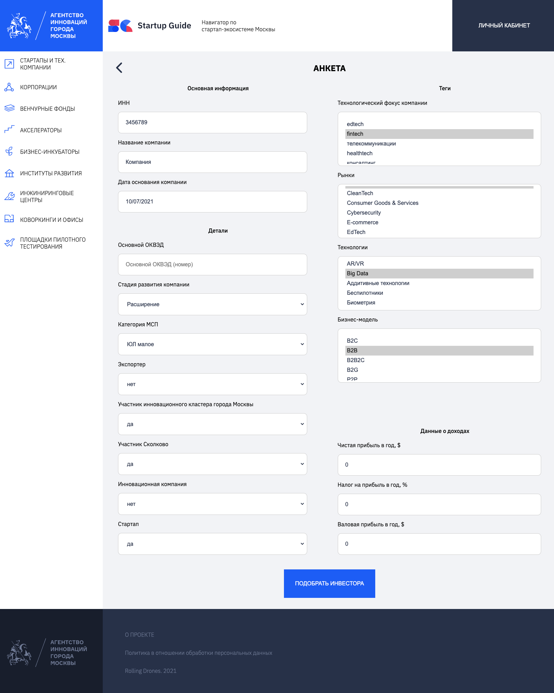

# Rolling Drones - Innoagency Startup Recommendation

## Задача проекта

Текущий проект - это персонализированная рекомендательная система по сервисам Москвы для стартапов

## Quick Start

```bash
git clone https://github.com/NmadeleiDev/innoagency-startup-recommendation.git
cd innoagency-startup-recommendation

cp .env.example .env

docker-compose build
docker-compose up -d
```

или с использованием make

```bash
git clone https://github.com/NmadeleiDev/innoagency-startup-recommendation.git
cd innoagency-startup-recommendation

cp .env.example .env

make up
make up-c # с очисткой БД
```

## Структура проекта

Папки - части общего проекта. Каждая часть опционально имеет внутри Dockerfile. Все части соединены docker-compose файлом в корне проекта.

[](https://mermaid-js.github.io/mermaid-live-editor/edit/#eyJjb2RlIjoiZmxvd2NoYXJ0IExSXG4gICAgVVtVc2VyL0Zyb250XSA8LS0-IEJbQmFja2VuZF1cbiAgICBCPC0tPk1MW01vZGVsXSAgJiBNW01vbmdvREJdICYgUFxuICAgIFBbUGFyc2VyXS0tPk0iLCJtZXJtYWlkIjoie1xuICBcInRoZW1lXCI6IFwiZGFya1wiXG59IiwidXBkYXRlRWRpdG9yIjpmYWxzZSwiYXV0b1N5bmMiOnRydWUsInVwZGF0ZURpYWdyYW0iOmZhbHNlfQ)

### ML

Папка ML содержит в себе Jupyter Notebooks для подготовки данных и генерации рекомендаций.

Всего в проекте используется 2 модели:

- Класификатор для получения наиболее подходящего типа сервиса для компании (Частный фонд, гос. фонд, акселератор, частный инвестор, корпоративный инвестор)
- Класификатор для получения наиболее подходящего сервиса для компании

dataprep.py - подготовка данных для обоих классификаторов
investor_classifier.ipynb - создание и обучение модели рекомендации сервиса для компании
type_classifier.ipynb - создание и обучение модели рекомендации типа сервиса для компании

### Backend

Папка backend содержит код (python{FastAPI}) серверной части веб-приложения, API для приема запросов от клиентской части веб-приложения (frontend) и логику работы с обученной моделью.

Бекенд взаимодействует с БД и производит следующие операции:

- Получает, вставляет или удаляет (CRUD) сущности (стартапы, компании, акселераторы и сервисы)
- Полученные данные подготавливает/трансформирует, используя процедуры, описанные в папке ML
- Трансформирванные и подготовленные данные отправляет в обученную модель из папки ML и возвращает рекмендации клиенту.

Ниже представлена диаграмма взаимодействий компонент стека.

[](https://mermaid-js.github.io/mermaid-live-editor/edit#eyJjb2RlIjoiZmxvd2NoYXJ0IFRCXG4gICAgJSUgc3ViZ3JhcGggQmFja2VuZFxuICAgIEZbRnJvbnRdIC0tPnwxLiBHZXR0aW5nIGRhdGEgZnJvbSBmb3JtfCBCW0JhY2tlbmRdXG4gICAgQiA8LS0-fDIuIEZldGNoIERhdGEgQWJvdXQgU2VydmljZXN8IERCXG4gICAgQiA8LS0-fDMuIFByZXBhcmUgRGF0YSB3aXRoIHBpcGVsaW5lfCBNTFxuICAgIEIgPC0tPnw0LiBTZW5kIERhdGEgdG8gbW9kZWwgJiBnZXQgcHJlZGljdCBvZiBzZXJ2aWNlfCBNTFxuICAgICUlIGVuZFxuICAgIHN1YmdyYXBoIE1MXG4gICAgUFtTY2lraXQtbGVhcm4gUGlwZWxpbmVzXVxuICAgIE1bVGVuc29yZmxvdyBNb2RlbF1cbiAgICBlbmQiLCJtZXJtYWlkIjoie1xuICBcInRoZW1lXCI6IFwiZGFya1wiXG59IiwidXBkYXRlRWRpdG9yIjpmYWxzZSwiYXV0b1N5bmMiOnRydWUsInVwZGF0ZURpYWdyYW0iOmZhbHNlfQ)

### Front

Папка front содержит код (NodeJS{React}) клиентской части веб-приложения.

### Parser

Папка parser содержит код для парсинга данных компаний по ИНН для пополнения датасета и дообучения модели.

### DB

Так как данные разрежены (по многим аттрибутам много пробелов), мы решили отказаться от реляционных БД в пользу NoSQL подобных. Поэтому качестве базы данных взяли MongoDB.

## Документация по интерфейсу

Документация по интерфейсу в формате OpenAPI (Swagger) доступна по адресу <https://startup-guide.ml/backend/docs>

По адресу <https://startup-guide.ml> также доступна демо-версия проекта.

## Пользовательская история / сценарий использования

### Главный экран

[](./images/form1.png)

### Экран заполнения анкеты о стартапе

[](./images/frame2.png)

### Экран выданных рекмендаций сервисов Москвы
